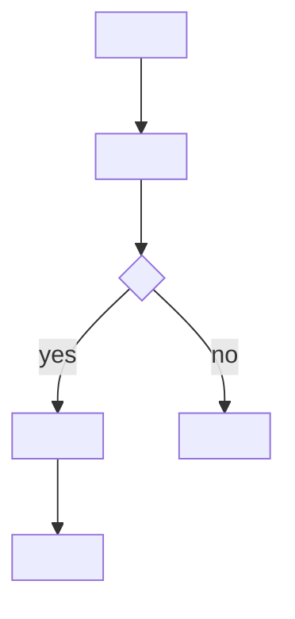

# Olko PR Description Update

## PR body template

````markdown
Resolves: SYM-<task>
Related <PBI|Bug>: SYM-<second>

## Summary
- <what changed>
- <important implementation note if any>

## PBI / Bug Context
<4 sentences: what PBI/Bug required -> root problem -> how change addresses it -> observable outcome>

## Flow



## Performance Impact
- <1 line: effect on throughput, latency, or resource usage of existing mechanism>
- <1 line: neutral / improvement / regression, and why>

## Testing
- <checks run>
````
